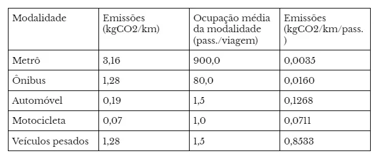
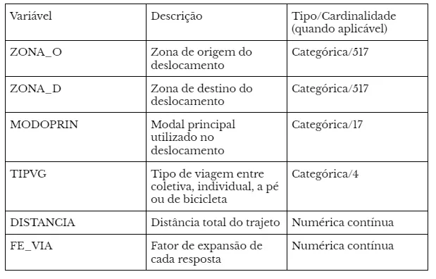
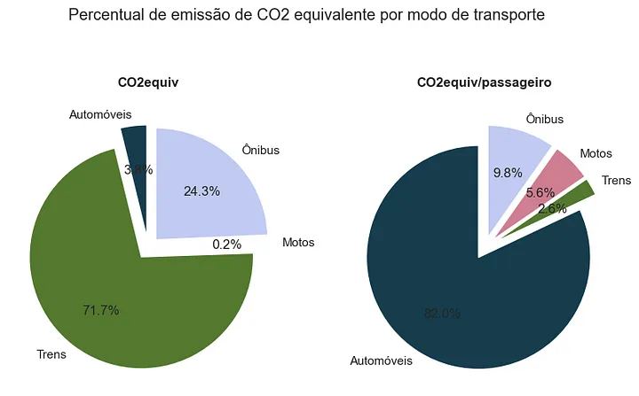
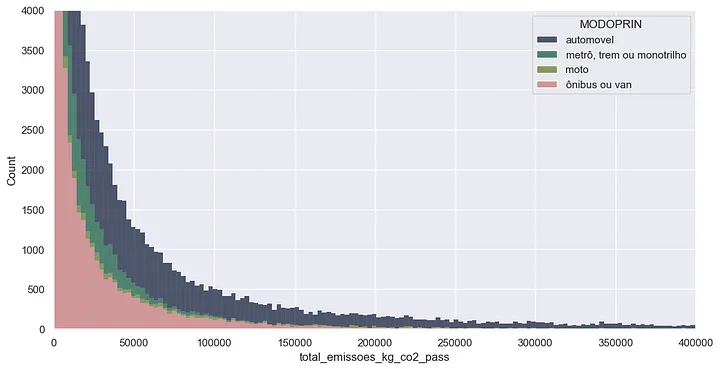
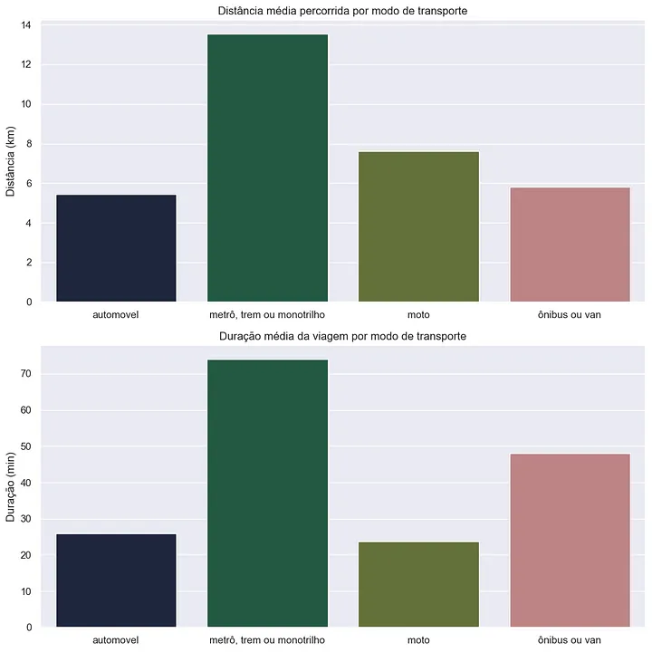
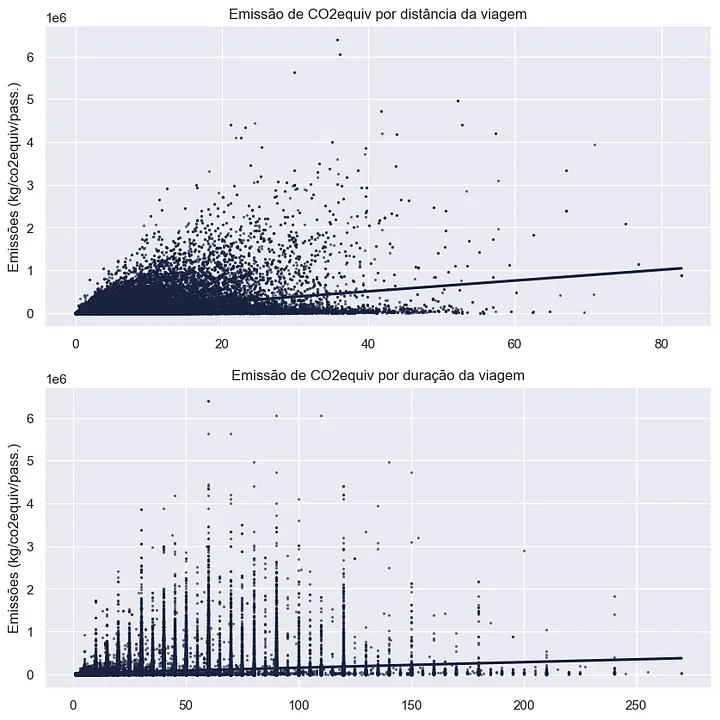
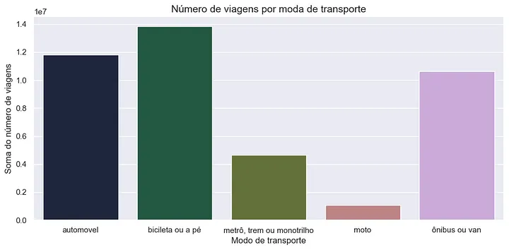
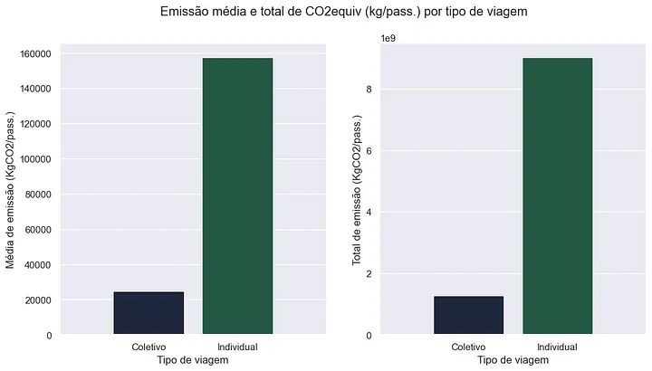
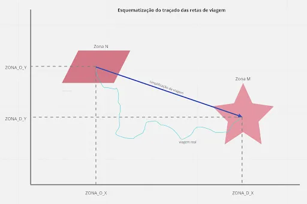
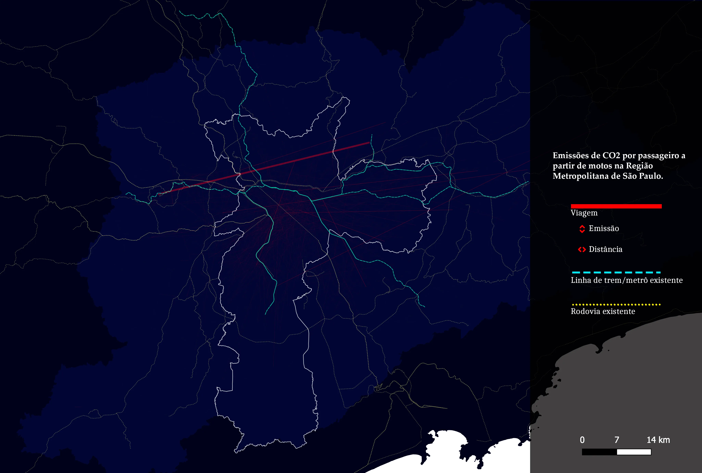

# Mapeamento de CO2 a partir de trajetos do trânsito em São Paulo

- [Mapeamento de CO2 a partir de trajetos do trânsito em São Paulo](#mapeamento-de-co2-a-partir-de-trajetos-do-trânsito-em-são-paulo)
  - [O notebook com o código de análise está disponível aqui](#o-notebook-com-o-código-de-análise-está-disponível-aqui)
  - [0. Introdução e problema](#0-introdução-e-problema)
  - [1. Método de trabalho](#1-método-de-trabalho)
  - [2. Análise da emissão de CO2 por modalidade](#2-análise-da-emissão-de-co2-por-modalidade)
  - [3. Mapeamento de CO2 nos trajetos](#3-mapeamento-de-co2-nos-trajetos)
  - [4. Conclusão](#4-conclusão)
  
## O notebook com o código de análise está disponível [aqui](analise.md)

## 0. Introdução e problema

Se fizéssemos o exercício de listar os principais desafios para a humanidade durante o século XXI, é quase certo que o enfrentamento ao aumento das temperaturas e às mudanças climáticas estaria entre os itens da lista e talvez até encabeçasse as preocupações da humanidade. O aumento da temperatura global é um problema sério, complexo e intensamente estudado; o relatório do IPCC (Intergovernamental Painel on Climate Change), por exemplo, reúne o trabalho de milhares de pesquisadores de diversas áreas acerca das mudanças climáticas, com foco no entendimento das motivações do aumento das temperaturas, bem como de meios de mitigação e de adaptação dos problemas ocasionados por essas.

A essa altura, é seguro dizer que é um consenso científico a relação entre o aumento da emissão de Gases de Efeito Estufa (GHG) e a intensificação dos processos de aquecimento do planeta. Um dos GHGs mais recorrentes é o CO2 — o dióxido de carbono — que é emitido por uma série de ações humanas, desde a respiração até as ações de queimada de florestas, por exemplo.

Um dos principais ambientes de emissão de CO2 é o trânsito, onde a grande maioria dos meios de transporte produz dióxido de carbono através da queima de combustíveis fósseis para o deslocamento. A emissão de altos índices de GHG pelo trânsito não é um tópico novo e muito já foi estudado sobre o assunto, no entanto, é sempre possível criar novas leituras. Pensando nisso, a ideia desse ensaio é a de tentar mapear o caminho do carbono no trânsito na cidade de São Paulo, o rastreio do carbono não é um método novo, mas esse texto procura identificar uma forma diferente de visualização da temática, utilizando a ciência de dados e a análise de dados georreferenciados.

## 1. Método de trabalho

Pensando que a emissão de CO2 no trânsito se dá pela queima dos combustíveis utilizados pelos automóveis, é intuitivo pensar que o monitoramento da emissão de CO2 deve ter como base o monitoramento dos deslocamentos dos automóveis. No cálculo da emissão de CO2 de uma única viagem é fundamental saber o tipo de veículo (carro, trem, moto, etc.), a distância percorrida no trajeto e o índice de emissão de CO2.

Para a obtenção do índice de emissão, o cálculo não é simples pois, falando sobre veículos, considera-se uma série grande de fatores como o tipo de combustível utilizado, o tempo de fabricação do carro, a hora do dia, o local do percurso, entre outros. Por sorte, um trabalho de determinação dos índices de emissão de gases de efeito estufa foi previamente realizado aqui, o trabalho realiza uma generalização dos deslocamentos e, como sempre, os resultados da pesquisa devem ser tomados com cautela, visto que indicam uma média entre os automóveis. No trabalho os índices são considerados em kgCO2/km e kgCO2/km/pass:



As emissões são consideradas a partir do valor absoluto por cada modal, mas também por um índice particularmente interessante: o montante de emissões em relação ao número de passageiros. Esse índice é importante porque, considerando a diferença de estrutura entre um automóvel e um trem, por exemplo, é intuitivo verificar que um veículo individual emite muito menos CO2, no entanto, quando é considerada a quantidade de passageiros que um trem e um automóvel servem, em média, então as emissões de CO2 do metrô acabam sendo resultado de um serviço utilizado por uma quantidade significativamente maior de pessoas.

Por hora, não existem dados abertos com as informações precisas de todos os deslocamentos de veículo na cidade (provavelmente porque esse monitoramento seria fruto de um trabalho árduo), no entanto, uma estimativa dos deslocamentos é possível a partir dos dados da Pesquisa Origem e Destino do Metrô-SP. A “Pesquisa OD” é realizada na Região Metropolitana de São Paulo, através da aplicação de questionários onde são entendidos os deslocamentos realizados pelos pesquisados; são obtidas informações como o motivo do deslocamento, o ponto de origem e destino da viagem, o modal utilizado para o transporte, as características socioeconômicas do transeunte, entre outros. Para facilitação da metodologia, a pesquisa divide a região de São Paulo em 517 zonas de respostas. A pesquisa contém uma série de variáveis, nesse momento são apresentadas as variáveis mais importantes para esse trabalho:



Para a utilização da pesquisa OD, foi obtido o arquivo em extensão .dbf com tamanho (183092, 128) que contém as informações sobre cada uma das respostas ao questionário, bem como os dados geográficos das zonas em formato .shp. Os dados de resposta foram georreferenciados a partir da extração dos centroides de cada uma das zonas, as manipulações geográficas para obtenção dos centroides estão disponíveis nesse código.

## 2. Análise da emissão de CO2 por modalidade

Apesar do grande tamanho da base, os dados da Pesquisa OD não requerem uma complexa engenharia na manipulação para serem utilizados. Como esse trabalho teve ênfase principalmente no dimensionamento e mapeamento do CO2, sem nenhum tipo de criação de modelo de inteligência artificial (pelo menos nesse momento), o processo de feature engineering foi dedicado à remoção de colunas com muito valores nulos, à conversão do tipo de algumas variáveis (uma vez que todas foram importadas como variáveis numéricas) e, principalmente, à criação de novas colunas que ajudam a interpretação do trabalho. Todo o trabalho de manipulação e análise dos dados da pesquisa de Origem e Destino do metrô foi realizado através de Python e o código está disponível aqui.

Foram criadas as colunas de referência do índice de emissão de CO2kg e CO2kg/pass, como conferidas no artigo apresentado anteriormente no texto; também foram criadas as colunas “CO2kg” e CO2kg/pass que estimam a quantidade CO2 total e por passageiro emitida por viagem, a partir das equações:

>EmissaoCO2 (kg) = ÍndiceEmissão*Distancia *Fator de expansão

>EmissaoCO2 (kg/pass) = ÍndiceEmissão/pass*Distancia *Fator de expansão

Resumidamente, foram atribuídos valores de emissão de CO2 para cada linha da pesquisa a partir de 3 variáveis principais: o modo de transporte (que atribui os índices de emissão de CO2), a distância do trajeto e o número de viagens daquele tipo (indicadas pela pesquisa OD na variável “fator de expansão”).

A leitura primária das emissões de CO2 nos trajetos em São Paulo indica que, se considerados os valores absolutos de emissão, os trens apresentaram um valor consideravelmente maior em uma primeira análise. No entanto, uma consideração muito fundamental deve ser realizada: é remota a situação de um trem que circule com apenas 1 ou 2 passageiros. Essa verificação mostra a importância de considerar o número de passageiros na conta das emissões de carbono, isso é, se um trem emite mais CO2, também demanda uma infraestrutura muito maior e transporta significativamente mais passageiros em uma viagem. Quando são analisados os índices de emissão por passageiro é nítido que a maior parte da emissão provém de automóveis, cerca de 82%. O histograma de distribuição dos valores de emissão de CO2/pass aponta que os automóveis também contabilizam mais viagens com valores consideravelmente maiores de emissão por passageiro.




A exploração da emissão de CO2 pode considerar, também, as características das viagens. O cálculo da emissão considera, de fato, a distância e o número de viagens em cada modal, assim, é interessante considerar a leitura dessas variáveis para o melhor entendimento da dinâmica de emissão. Verificando a distância e duração média das viagens, os automóveis apontam baixos valores em relação ao conjunto, apresentando viagens de cerca de 6km e 30 minutos de duração, paralelamente, as viagens realizadas nos trens têm duração consideravelmente maior e cruzam maiores distâncias, cerca de 14km; a performance das motos é consideravelmente melhor, uma vez que cruzam cerca de 8km e têm viagens curtas e as viagens de ônibus tem, em média, a mesma distância percorrida dos automóveis, em uma duração de tempo maior.



Nesse sentido, deve-se ponderar que a distância percorrida e a duração do trajeto não são os fatores preponderantes na emissão de CO2/pass, uma vez que os maiores emissores são automóveis apresentam um perfil de uso com ênfase em viagens rápidas e de curta distância; em fato, considerando a emissão de CO2/pass como variável resposta, sua correlação com as variáveis de distância (0.41) e duração (0.19) é relativamente baixa. A inspeção gráfica aponta alguma correlação com a distância percorrida, mas indica grande dispersão dos dados.



A contagem de viagens foi obtida a partir da soma dos valores de fator de expansão para cada linha da base e agrupada por tipo de transporte (apenas por uma questão de curiosidade, foi inserido no gráfico o número de viagens de pé ou bicicleta), nesse caso, o gráfico confirma uma suposição facilmente verificável na cidade: a grande maioria das viagens ocorre por automóvel. O baixo número de viagens a partir de motos é, provavelmente, a principal razão pela baixa participação do modal na emissão de CO2/pass, um quadro que provavelmente deve se alterar em pesquisas futuras, uma vez que após 2017 foi verificado um boom nos serviços de delivery realizados por esse modo de transporte. O número de viagens, no entanto, também não explica sozinho os altos valores de emissão de automóveis, uma vez que os ônibus apresentam uma quantidade considerável dos trajetos, mas uma participação nas emissões consideravelmente menor. A correlação identificável entre a variável resposta e o número de viagens é de 0.25.



A inspeção das duas variáveis indica que a duração, a distância ou o número de viagens não explicam, sozinhos, o dispersão da emissão de CO2/pass entre os modos de transporte, assim, é averiguada a importância do número de passageiros nessa métrica, uma vez que o modal com maior índice de CO2/pass é, também, o com maior somatório de emissões desse tipo. Essa é uma comprovação numérica que embasa uma ideia que pode ser facilmente verificada na prática: quando considerada a eficiência dos modos de transporte a partir do número de passageiros por viagem, o modal que emite mais CO2 é, também, um dos que comporta menos passageiros por viagem. A averiguação fica nítida quando são verificadas as emissões totais e médias de CO2/pass por tipo de viagem.



A distância, o índice de emissão de CO2/pass. e o número de viagens são variáveis que não explicam, sozinhas, a dinâmica das emissões entre os transportes em São Paulo. No entanto, a análise conjunta das variáveis permite verificar um quadro onde mais de 8/10 das emissões de CO2/pass. são realizadas por automóveis que tem viagens médias curtas e de baixa duração, mas que acontecem em grande quantidade e emitem alto índice de CO2 por viagem. Cabe, a seguir, um mapeamento dessas viagens, permitindo visualizar a dispersão dos trajetos.

## 3. Mapeamento de CO2 nos trajetos

O mapeamento dos trajetos emissores de CO2 foi realizado a partir da conexão entre os centróides das zonas de origem e destino de cada viagem, de modo a ser criada uma reta entre os dois pontos. O traçado obviamente é uma simplificação do trajeto real realizado na viagem, mas ajuda a verificar as dinâmicas de emissão no trânsito da cidade. Para a criação do traçado foram criadas as variáveis ZONA_O_X, ZONA_O_Y, ZONA_D_X e ZONA_D_Y que contém as coordenadas dos centróides de cada forma



O processo foi realizado por python, onde foram extraídos os centróides do arquivo .shp, criadas as quatro variáveis de coordenadas para cada viagem e realizadas as criações das retas a partir dessas informações. Mais pode ser visualizado no código.

```python
def extrai_centroides_shape(path, feature_id='id', feature_geometria='geometry'):
    '''Recebe o caminho do arquivo .shp e retorna um dicionário
    com o ID da zona como chave e as posições X e Y do centroide
    como valor. Verificar se os nomes das features estão corretas
    no shape'''
    centroides = []

    with fiona.open(path) as shp:
        for feature in shp:
            id = feature[feature_id]
            geometry = shape(feature[feature_geometria])
            # Get the centroid and add it to the list with the ID
            centroid = geometry.centroid
            centroides.append([int(id), centroid.x, centroid.y])
        dict_centroides = {item[0]: (item[1], item[2]) for item in centroides}
    return dict_centroides

def concatena_centroides_zonas(dataframe, dicionario_centroides, coluna_zona_origem='ZONA_O', coluna_zona_destino='ZONA_D'):
    '''Recebe um dataframe e um dicionário com o id das zonas e o valor dos centróides,
        cria variáveis dos eixos X e Y de origem e destino de acordo com o match entre
        o nome da chave do dicionário e o nome das colunas de origem e destino'''
    for index, row in dataframe.iterrows():
            for key, value in dicionario_centroides.items():
                if row[coluna_zona_origem] == key:
                    dataframe.at[index, 'ZONA_O_X'] = value[0]
                    dataframe.at[index, 'ZONA_O_Y'] = value[1]
                if row[coluna_zona_destino] == key:
                    dataframe.at[index, 'ZONA_D_X'] = value[0]
                    dataframe.at[index, 'ZONA_D_Y'] = value[1]

def cria_linhas_geometria(dataframe, x1='CO_O_X', y1='CO_O_Y', x2='CO_D_X', y2='CO_D_Y'):
    '''Cria linhas de geometria que conectam os pontos de origem
    a partir das colunas de um dataframe.
    As colunas devem conter as informações de posição X e Y de origem e destino.
    Cria retas, logo, requer exatamente dois pontos'''
    geometria = [LineString([(row[x1], row[y1]), (row[x2], row[y2])]) for idx, row in dataframe.iterrows()]
    return geometria
```

Na visualização dos mapas, a largura da linha dá alguma noção sobre a distância do trajeto, sua espessura indica a quantidade de CO2/pass emitida na viagem e a concentração de cor aponta um maior número de viagens se cruzando naquela zona.


O mapa com todas as linhas de viagem (sem espessura por emissão), indicado acima, permite visualizar uma grande concentração das viagens na região central do município de São Paulo, no entanto, ainda é difícil entender a dinâmica das emissões de CO2 a partir desse.

A visualização dos mapas a partir dos modos de transporte facilita a leitura e confirma o que a análise dos dados já havia indicado anteriormente: a emissão de CO2 por viagens de automóveis é consideravelmente maior do que a de outros modos. As viagens desse modo tem uma conformação radial em relação ao centro do município de São Paulo e acontecem em grande quantidade, com emissões consideravelmente grandes em cada trajeto.




É interessante notar que a maioria das viagens de automóvel ocorre entre a região central do município e demais zonas dentro do raio de atendimento das linhas de trem e metrô do Estado de São Paulo, ou seja, se verifica é que a grande maioria da emissão de CO2 por automóveis ocorre em trajetos radiais de média distância que podem ser realizados a partir da infraestrutura de transportes municipais e estaduais. A conformação radial dos deslocamentos pode ser verificada também entre trens e ônibus, mas a emissão de CO2 por esses modos é drasticamente menor; o mapa aponta a eficiência dos ônibus no controle das emissões, visto os baixíssimos índices a partir dos longos deslocamentos realizados, essa característica, no entanto, deve ser considerada em par com a performance do modal no deslocamento, uma vez que esse perde espaço para outros modais (como trens e metrôs) na eficiência e velocidade do deslocamento. Comparativamente, a emissão de CO2 por motos é baixíssima e não apresenta característica radial como as outras, no entanto, essa análise deve ser tomada com cautela, uma vez que o perfil desses deslocamentos pode ter mudado largamente desde o momento da pesquisa OD.

## 4. Conclusão

A análise deixa nítida a grande discrepância na quantidade e dinâmica de emissão entre cada modal, mas análises ainda mais interessantes são possíveis, uma análise mais detalhada pode considerar a motivação das viagens, as condições socioeconômicas, a melhor descrição dos modais ou mesmo um refinamento nas geometrias. Por hora, esse ensaio busca apontar um caminho de leitura possível, enquanto aponta que a diminuição da emissão de CO2 no trânsito deve considerar modos de transporte mais eficientes e menos poluentes.
