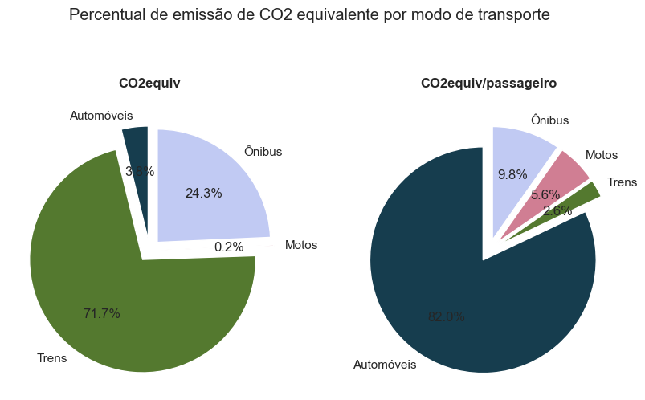
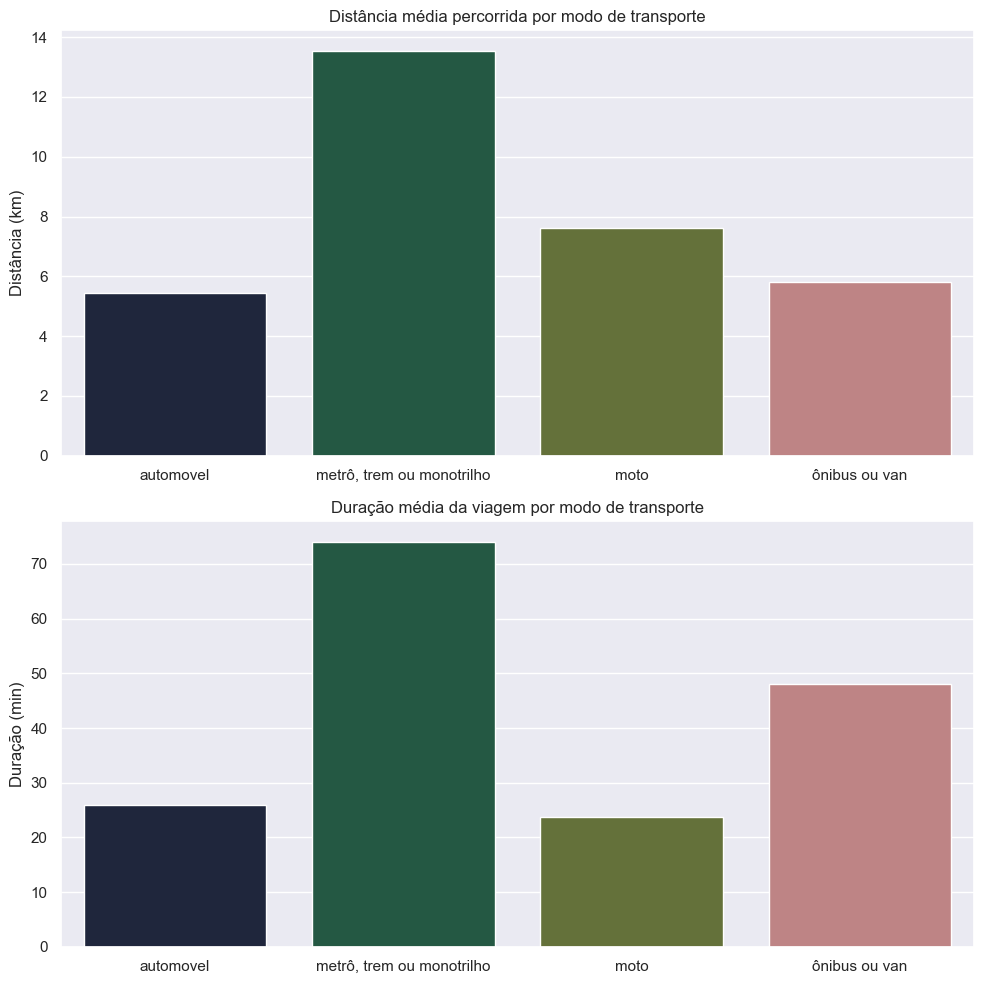
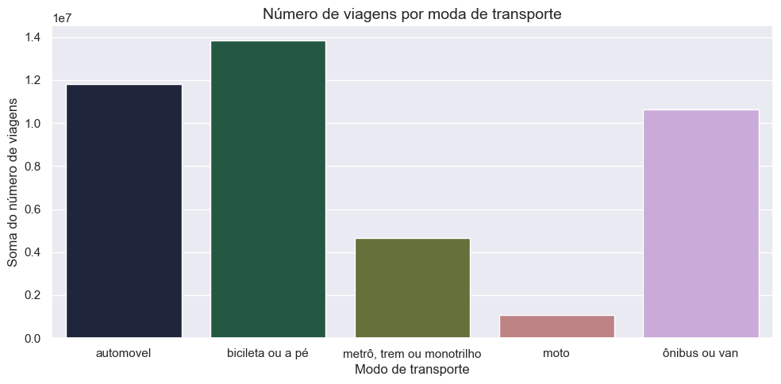
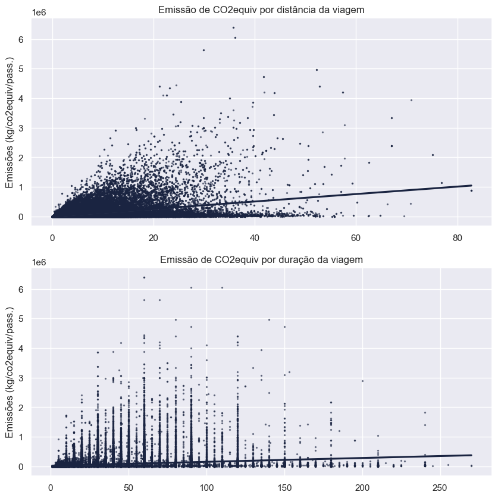
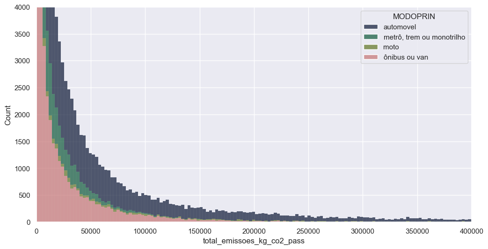
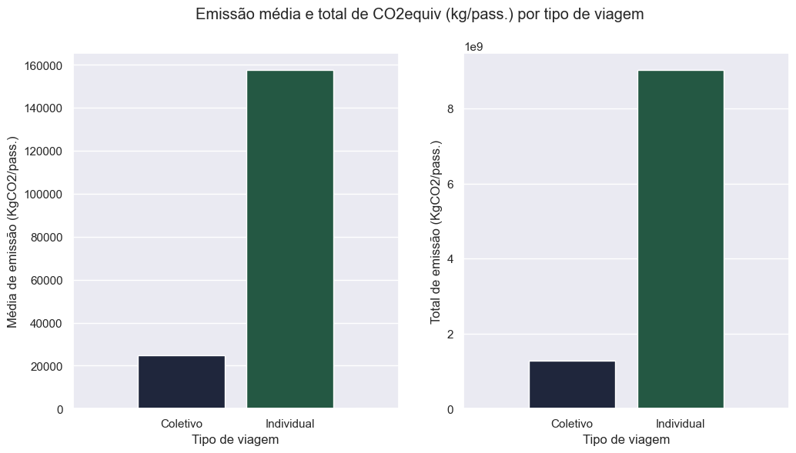

# Mapeamento de CO2 a partir de trajetos do trânsito em São Paulo

Notebook de suporte para a verificação das emissões de CO2 a partir de diferentes modos de transporte na cidade de São Paulo. A análise realizada a partir da manipulação dos dados realizada nesse notebook está disponível em https://medium.com/@lisses/mapeando-os-trajetos-da-emiss%C3%A3o-de-carbono-no-tr%C3%A2nsito-de-s%C3%A3o-paulo-7318f850b072

## 0. Pré-processamento

### 0.1 Importando as bibliotecas utilizadas no projeto


```python
#import csv
#from dbfread import DBF 
import pandas as pd
import seaborn as sns
import matplotlib.pyplot as plt

import warnings 
warnings.filterwarnings("ignore")

sns.set(style="darkgrid", palette='cubehelix')
```

### 0.2 Definindo funções do código

As funções do código criam os valores de emissão a partir de índices do IPEA, categorizam o dataframe para apurar leituras e removem valores extremos


```python
def cria_emissoes_kg_co2_km(x: float) -> float:
    if x <= 3:
        return 3.16
    elif 3 < x <= 8:
        return 1.28
    elif 8 < x <= 12:
        return 0.19
    elif 12 < x <= 14:
        return 0.07
    else:
        return 0
    
def cria_emissoes_kg_co2_km_pass(x: float) -> float:
    if x <= 3:
        return 0.0035
    elif 3 < x <= 8:
        return 0.0160
    elif 8 < x <= 12:
        return 0.1268
    elif 12 < x <= 14:
        return 0.0711
    else:
        return 0

def categoriza_modo_principal(x: float) -> str:
    if x <= 3:
        return "metrô, trem ou monotrilho"
    elif 3 < x <= 8:
        return "ônibus ou van"
    elif 8 < x <= 12:
        return "automovel"
    elif 12 < x <= 14:
        return "moto"
    else:
        return "bicileta ou a pé"

def cria_emissao_co2_total(dataframe: pd.DataFrame(), referencia: float, fator_expansao='FE_VIA', distancia='DISTANCIA') -> pd.Series():
    return dataframe[referencia]*dataframe[fator_expansao]*dataframe[distancia]

def remove_percentil(dataframe: pd.DataFrame(), column: str, percentile=0.95) -> pd.Series():
    percentil = dataframe[column].quantile(percentile)
    return dataframe[dataframe[column] <= percentil]

```

### 0.3 Convertendo o arquivo dbf

o arquivo orginal com as informações sobre os trajetos vem no formato dbf, assim, é realizada a conversão para csv. A conversão foi feita para facilitação na manipulação do dataframe, o trecho do código foi comentado porque o arquivo foi salvo em csv no primeiro uso.


```python
#dbf_file = DBF('OD 2017/OD_2017_v1.dbf')

#with open('OD_2017_original.csv', 'w', newline='') as csvfile:
#    writer = csv.writer(csvfile)
#    writer.writerow(dbf_file.field_names)
#    for record in dbf_file:
#        writer.writerow(list(record.values()))
```

## 1. Inspeção inicial da base

### 1.1 Conhecimento dos dados 

A base original possui apenas variáveis numéricas dos tipos int e float. Algumas dessas variáveis numéricas são códigos descritos na documentação


```python
#Importando a pesquisa Origem e Destino original
df = pd.read_csv('OD_2017_original.csv')
print(df.shape)
df.info(verbose=True)
```

    (183092, 128)
    <class 'pandas.core.frame.DataFrame'>
    RangeIndex: 183092 entries, 0 to 183091
    Data columns (total 128 columns):
     #    Column      Dtype  
    ---   ------      -----  
     0    ZONA        int64  
     1    MUNI_DOM    int64  
     2    CO_DOM_X    int64  
     3    CO_DOM_Y    int64  
     4    ID_DOM      int64  
     5    F_DOM       int64  
     6    FE_DOM      float64
     7    DOM         int64  
     8    CD_ENTRE    int64  
     9    DATA        int64  
     10   TIPO_DOM    int64  
     11   AGUA        int64  
     12   RUA_PAVI    int64  
     13   NO_MORAD    int64  
     14   TOT_FAM     int64  
     15   ID_FAM      int64  
     16   F_FAM       int64  
     17   FE_FAM      float64
     18   FAMILIA     int64  
     19   NO_MORAF    int64  
     20   CONDMORA    int64  
     21   QT_BANHO    float64
     22   QT_EMPRE    float64
     23   QT_AUTO     float64
     24   QT_MICRO    float64
     25   QT_LAVALOU  float64
     26   QT_GEL1     float64
     27   QT_GEL2     float64
     28   QT_FREEZ    float64
     29   QT_MLAVA    float64
     30   QT_DVD      float64
     31   QT_MICROON  float64
     32   QT_MOTO     float64
     33   QT_SECAROU  float64
     34   QT_BICICLE  float64
     35   NAO_DCL_IT  int64  
     36   CRITERIOBR  float64
     37   PONTO_BR    float64
     38   ANO_AUTO1   float64
     39   ANO_AUTO2   float64
     40   ANO_AUTO3   float64
     41   RENDA_FA    float64
     42   CD_RENFA    int64  
     43   ID_PESS     int64  
     44   F_PESS      int64  
     45   FE_PESS     float64
     46   PESSOA      int64  
     47   SIT_FAM     int64  
     48   IDADE       int64  
     49   SEXO        int64  
     50   ESTUDA      int64  
     51   GRAU_INS    int64  
     52   CD_ATIVI    int64  
     53   CO_REN_I    int64  
     54   VL_REN_I    float64
     55   ZONA_ESC    float64
     56   MUNIESC     float64
     57   CO_ESC_X    float64
     58   CO_ESC_Y    float64
     59   TIPO_ESC    float64
     60   ZONATRA1    float64
     61   MUNITRA1    float64
     62   CO_TR1_X    float64
     63   CO_TR1_Y    float64
     64   TRAB1_RE    float64
     65   TRABEXT1    float64
     66   OCUP1       float64
     67   SETOR1      float64
     68   VINC1       float64
     69   ZONATRA2    float64
     70   MUNITRA2    float64
     71   CO_TR2_X    float64
     72   CO_TR2_Y    float64
     73   TRAB2_RE    float64
     74   TRABEXT2    float64
     75   OCUP2       float64
     76   SETOR2      float64
     77   VINC2       float64
     78   N_VIAG      float64
     79   FE_VIA      float64
     80   DIA_SEM     float64
     81   TOT_VIAG    int64  
     82   ZONA_O      float64
     83   MUNI_O      float64
     84   CO_O_X      float64
     85   CO_O_Y      float64
     86   ZONA_D      float64
     87   MUNI_D      float64
     88   CO_D_X      float64
     89   CO_D_Y      float64
     90   ZONA_T1     float64
     91   MUNI_T1     float64
     92   CO_T1_X     float64
     93   CO_T1_Y     float64
     94   ZONA_T2     float64
     95   MUNI_T2     float64
     96   CO_T2_X     float64
     97   CO_T2_Y     float64
     98   ZONA_T3     float64
     99   MUNI_T3     float64
     100  CO_T3_X     float64
     101  CO_T3_Y     float64
     102  MOTIVO_O    float64
     103  MOTIVO_D    float64
     104  MOT_SRES    float64
     105  SERVIR_O    float64
     106  SERVIR_D    float64
     107  MODO1       float64
     108  MODO2       float64
     109  MODO3       float64
     110  MODO4       float64
     111  H_SAIDA     float64
     112  MIN_SAIDA   float64
     113  ANDA_O      float64
     114  H_CHEG      float64
     115  MIN_CHEG    float64
     116  ANDA_D      float64
     117  DURACAO     float64
     118  MODOPRIN    float64
     119  TIPVG       float64
     120  PAG_VIAG    float64
     121  TP_ESAUTO   float64
     122  VL_EST      float64
     123  PE_BICI     float64
     124  VIA_BICI    float64
     125  TP_ESBICI   float64
     126  DISTANCIA   float64
     127  ID_ORDEM    int64  
    dtypes: float64(95), int64(33)
    memory usage: 178.8 MB
    

### 1.2 Feature engineering do dataframe 


Foram removidas várias colunas, consideradas desinteressantes para o trabalho ou com muitos valores nulos. As colunas categóricas tiveram seu tipo alterado. Também foram criadas novas colunas no dataframe para aquisição de alguns índices interessantes para o trabalho.
 Os detalhes sobre cada coluna estão disponíveis no arquivo LAYOUT OD2017_v1.xlsx


```python
#REMOVENDO COLUNAS DE IDENTIFICAÇÃO E COM MUITOS VALORES NULOS. TRANSFORMANDO COLUNAS NUMÉRICAS EM CATEGORIAS.

target = 'total_emissoes_kg_co2_pass'

colunas_removidas = ['ID_DOM', 'F_DOM', 'DOM', 'CD_ENTRE', 'DATA', 'AGUA', 'RUA_PAVI', 'ID_FAM', 'F_FAM', 'QT_BANHO', 'QT_EMPRE',
                     'QT_MICRO', 'QT_LAVALOU', 'QT_GEL1', 'QT_GEL2', 'QT_FREEZ', 'QT_MLAVA', 'QT_DVD', 'QT_MICROON', 'QT_SECAROU',
                     'NAO_DCL_IT', 'PONTO_BR', 'CD_RENFA', 'ID_PESS', 'F_PESS', 'PESSOA', 'MUNIESC', 'VINC1', 'VINC2',
                     'DIA_SEM', 'PAG_VIAG', 'TP_ESAUTO', 'VL_EST', 'VIA_BICI', 'TP_ESBICI']


colunas_categoricas = ['ZONA', 'MUNI_DOM', 'TIPO_DOM', 'CONDMORA', 'CRITERIOBR', 'SIT_FAM', 'SEXO', 'ESTUDA', 'GRAU_INS', 'CD_ATIVI', 'CO_REN_I', 'TRAB1_RE', 'TRABEXT1', 'OCUP1',
                       'SETOR1', 'MUNITRA1', 'MUNITRA2', 'TRAB2_RE', 'TRABEXT2', 'OCUP2', 'SETOR2', 'ZONA_O', 'MUNI_O', 'ZONA_D', 'MUNI_D', 'ZONA_T1', 'MUNI_T1', 'ZONA_T2', 'MUNI_T2', 'ZONA_T3',
                       'MUNI_T3', 'MOTIVO_O', 'MOTIVO_D', 'MOT_SRES', 'SERVIR_O', 'SERVIR_D', 'MODO1', 'MODO2', 'MODO3', 'MODO4', 'MODOPRIN', 'TIPVG', 'PE_BICI']

col_nulos = ['ANO_AUTO2', 'ANO_AUTO3', 'ZONA_ESC', 'CO_ESC_X', 'CO_ESC_Y', 'TIPO_ESC', 'ZONATRA2', 'MUNITRA2', 'CO_TR2_X', 'CO_TR2_Y', 'TRAB2_RE', 'TRABEXT2', 'OCUP2', 'SETOR2',
             'ZONA_T1', 'MUNI_T1', 'CO_T1_X', 'CO_T1_Y', 'ZONA_T2', 'MUNI_T2', 'CO_T2_X', 'CO_T2_Y', 'ZONA_T3', 'MUNI_T3', 'CO_T3_X', 'CO_T3_Y', 'MODO2', 'MODO3', 'MODO4', 'PE_BICI']

df = base.drop(colunas_removidas, axis=1)
df[colunas_categoricas] = df[colunas_categoricas].astype('category'); 
df = df.drop(col_nulos, axis=1)
```


```python
#CRIANDO NOVAS COLUNAS NA BASE E DIMINUINDO A CARDINALIDADE DO MODO PRINCIPAL
df['ref_emissoes_kg_co2_km'] = df['MODOPRIN'].apply(cria_emissoes_kg_co2_km)
df['ref_emissoes_kg_co2_km_pass'] = df['MODOPRIN'].apply(cria_emissoes_kg_co2_km_pass)
df['total_emissoes_kg_co2'] = cria_emissao_co2_total(dataframe=df, referencia='ref_emissoes_kg_co2_km')
df['total_emissoes_kg_co2_pass'] = cria_emissao_co2_total(dataframe=df, referencia='ref_emissoes_kg_co2_km_pass')
df['MODOPRIN'] = df['MODOPRIN'].apply(categoriza_modo_principal)

#df.to_csv('OD_2017_Trabalhada.csv')
```

## 3. Análise Exploratória dos Dados


Averiguação das emissões a partir do tipo de transporte, segregando dados por tempo de viagem, duração, quantidade, etc.


```python
#CRIANDO UM NOVO DATAFRAME, AGRUPADO PELA SOMA DOS VALORES DOS MODOS DE TRANSPORTE
df_modos = df.groupby('MODOPRIN').sum()
df_modos = df_modos.drop(df_modos[df_modos.index=='bicileta ou a pé'].index)
labels =['Automóveis', 'Trens', 'Motos', 'Ônibus']
```


```python
#VERIFICAÇÃO DO PERCENTUAL DE EMISSÃO EM CADA MODO DE TRANSPORTE
fig, axes = plt.subplots(1, 2, figsize=(10, 5))

total = df_modos['total_emissoes_kg_co2'].sum()
axes[0].pie(df_modos['total_emissoes_kg_co2'], labels=labels, autopct='%1.1f%%', explode=[0.1, 0.1, 0.1, 0.1], startangle=90, colors=sns.color_palette('cubehelix', n_colors=4))
axes[1].pie(df_modos['total_emissoes_kg_co2_pass'], labels=labels, autopct='%1.1f%%', explode=[0.1, 0.1, 0.1, 0.1], startangle=90, colors=sns.color_palette('cubehelix', n_colors=4))

axes[0].set_title('CO2equiv', y=1.055, fontweight='bold')
axes[1].set_title('CO2equiv/passageiro', y=1.055, fontweight='bold')
fig.suptitle('Percentual de emissão de CO2 equivalente por modo de transporte', y=1.1)
```


    Text(0.5, 1.1, 'Percentual de emissão de CO2 equivalente por modo de transporte')


    

    


Se considerados os valores absolutos de emissão, os trens apresentaram um valor consideravelmente maior em uma primeira análise. No entanto, quando são analisados os índices de emissão por passageiro é nítido que a maior parte da emissão provém de automóveis, cerca de 82%.


```python
#CRIANDO UM NOVO DATAFRAME, AGRUPADO PELA MÉDIA DOS VALORES DOS MODOS DE TRANSPORTE
df_modos = df.groupby('MODOPRIN',  as_index=False).mean()
df_modos = df_modos.drop(df_modos[df_modos['MODOPRIN']=='bicileta ou a pé'].index)
```


```python
#PLOTANDO A DISTÂNCIA E A DURAÇÃO MÉDIA DAS VIAGENS EM CADA MODO DE TRANSPORTE
fig, axs = plt.subplots(ncols=1, nrows=2, figsize=(10,10))

sns.barplot(x=df_modos['MODOPRIN'], y=df_modos['DISTANCIA']/1000, ax=axs[0])
sns.barplot(x=df_modos['MODOPRIN'], y=df_modos['DURACAO'], ax=axs[1])

axs[0].set_title('Distância média percorrida por modo de transporte', fontsize=12)
axs[1].set_title('Duração média da viagem por modo de transporte', fontsize=12)
axs[0].set_ylabel('Distância (km)', fontsize=12)
axs[1].set_ylabel('Duração (min)', fontsize=12)
axs[0].set_xlabel('')
axs[1].set_xlabel('')
#axs[0].xticks(rotation=90)
plt.tight_layout()
```


    

    


Verificando a distância e duração média das viagens, os automóveis apontam baixos valores em relação ao conjunto, apresentando viagens de cerca de 6km e 30 minutos de duração, paralelamente, as viagens realizadas nos trens têm duração consideravelmente maior e cruzam maiores distâncias, cerca de 14km; a performance das motos é consideravelmente melhor, uma vez que cruzam cerca de 8km e têm viagens curtas e as viagens de ônibus tem, em média, a mesma distância percorrida dos automóveis, em uma duração de tempo maior.


```python
#PLOTANDO O NÚMERO DE VIAGENS DE CADA MODO DE TRANSPORTE
df_modos = df.groupby('MODOPRIN',  as_index=False).sum()
fig, axs = plt.subplots(ncols=1, nrows=1, figsize=(10,5))

sns.barplot(x=df_modos['MODOPRIN'], y=df_modos['FE_VIA'])
axs.set_xlabel('Modo de transporte')
axs.set_ylabel('Soma do número de viagens')
axs.set_title('Número de viagens por moda de transporte', fontsize=14)
fig.tight_layout()
```


    

    


A grande maioria das viagens ocorre por automóvel. O baixo número de viagens a partir de motos é, provavelmente, a principal razão pela baixa participação do modal na emissão de CO2/pass.


```python
#VERIFICANDO A CORRELAÇÃO NUMÉRICA ENTRE AS VARIÁVEIS DE DURAÇÃO/DISTÂNCIA/N. VIAGENS E A VARIÁVEL RESPOSTA
corr_distancia = df['total_emissoes_kg_co2_pass'].corr(df['DISTANCIA'])
corr_duracao = df['total_emissoes_kg_co2_pass'].corr(df['DURACAO'])
corr_quantidade_viagens = df['total_emissoes_kg_co2_pass'].corr(df['FE_VIA'])

print('correlação - Distância: {} \n Duração: {} \n Quantidade de Viagens: {}'.format(corr_distancia, corr_duracao,  corr_quantidade_viagens))
```

    correlação - Distância: 0.4178493770480493 
     Duração: 0.19673489484231785 
     Quantidade de Viagens: 0.25713663976501366
    


```python
#PLOTANDO A RELAÇÃO ENTRE A VARIÁVEL RESPOSTA E A DISTÂNCIA/DURAÇÃO DAS VIAGENS
fig, axs = plt.subplots(2, 1, figsize=(10, 10))
sns.regplot(x=df['DISTANCIA']/1000, y=df[target], ax=axs[0], scatter_kws={'s': 2,  'alpha': 0.5})
sns.regplot(x='DURACAO', y=target, data=df, ax=axs[1], scatter_kws={'s': 2,  'alpha': 0.5})

axs[0].set_title('Emissão de CO2equiv por distância da viagem')
axs[1].set_title('Emissão de CO2equiv por duração da viagem')

axs[0].set_xlabel('')
axs[1].set_xlabel('')
axs[0].set_ylabel('Emissões (kg/co2equiv/pass.)')
axs[1].set_ylabel('Emissões (kg/co2equiv/pass.)')
```


    Text(0, 0.5, 'Emissões (kg/co2equiv/pass.)')


    

    


A inspeção gráfica aponta alguma correlação com a distância percorrida, mas indica grande dispersão dos dados.


```python
#PLOTANDO O HISTOGRAMA DA DISTRIBUIÇÃO DAS EMISSÕES POR MODO DE TRANSPORTE
df_filtrada = df.drop(df[df['MODOPRIN']=='bicileta ou a pé'].index)

fig, ax = plt.subplots(figsize=(12, 6))

sns.histplot(x='total_emissoes_kg_co2_pass', hue='MODOPRIN', data=df_filtrada, multiple='stack', hue_order=['automovel', 'metrô, trem ou monotrilho', 'moto', 'ônibus ou van'])

ax.set_xlim(0,400000)
ax.set_ylim(0,4000)
```


    (0.0, 4000.0)


    

    


```python
#PLOTANDO A EMISSÃO MÉDIA E TOTAL POR TIPO DE TRANSPORTE
df_viagens_mean = df.groupby('TIPVG',  as_index=False).mean()
df_viagens_sum = df.groupby('TIPVG',  as_index=False).sum()

fig, axs = plt.subplots(1, 2, figsize=(12, 6))
sns.barplot(x='TIPVG', y='total_emissoes_kg_co2_pass', data=df_viagens_mean, ax=axs[0])
sns.barplot(x='TIPVG', y='total_emissoes_kg_co2_pass', data=df_viagens_sum)

for i in [0, 1]:
    axs[i].set_xlim(-1,2)
    axs[i].set_xticklabels(labels=["Coletivo", "Individual", '', ''])
    axs[i].set_xlabel('Tipo de viagem')

axs[0].set_ylabel('Média de emissão (KgCO2/pass.)')
axs[1].set_ylabel('Total de emissão (KgCO2/pass.)')
plt.suptitle('Emissão média e total de CO2equiv (kg/pass.) por tipo de viagem')


```


    Text(0.5, 0.98, 'Emissão média e total de CO2equiv (kg/pass.) por tipo de viagem')


    

    


O gráfico corrobora as asserções anteriores: os veículos de tipo individual contribuem largamente na emissão de CO2/equiv, de maneira desproporcional aos meios coletivos.

## 4. Conclusão

A análise dos dados indica que embora em termos absolutos os trens e metrôs realizem mais emissões de CO2, quandos são consideradas as circuntâncias de números de pessoas atendidas o quadro muda. A verificação dos dados de CO2/equiv mostra que os automóveis emitem CO2 de maneira desproporcional aos outros modais sem que essa emissão contribua em avanços para a coletividade.
